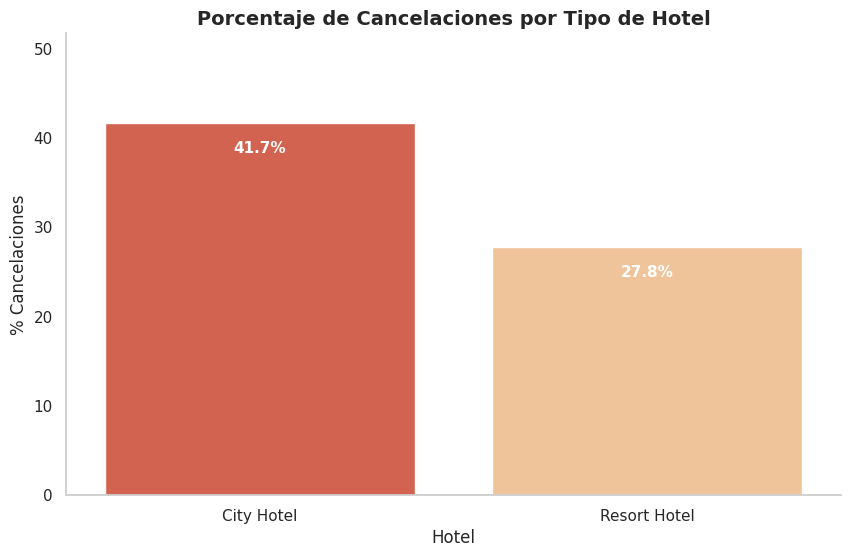
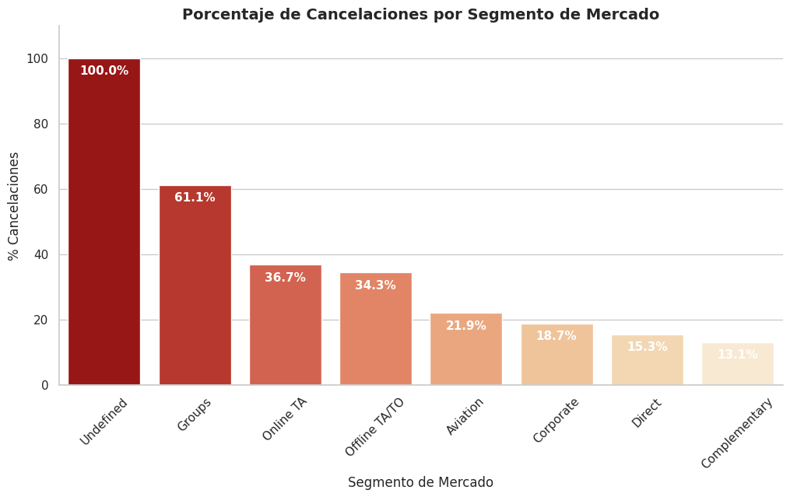
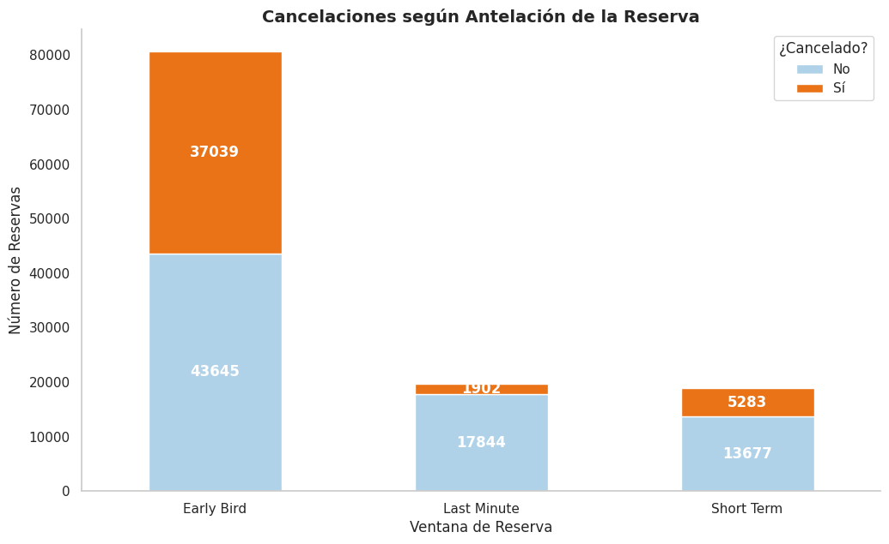
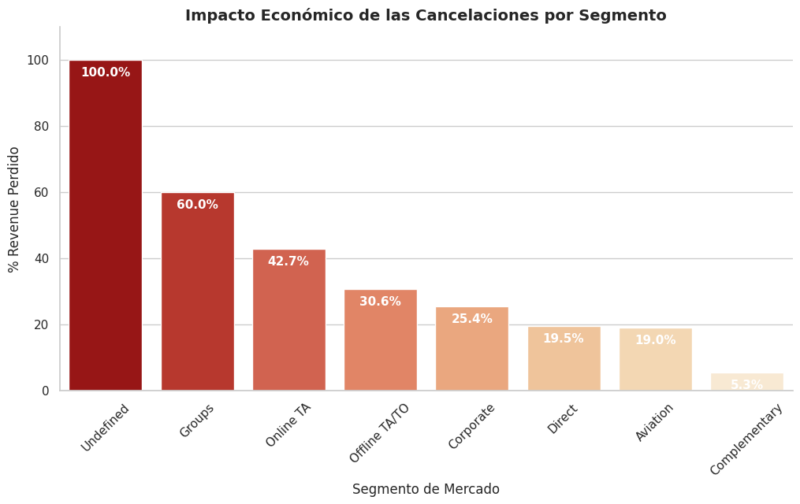

# Análisis de cancelaciones y revenue - Hotel Booking Dataset

## Objetivo del proyecto
El objetivo es analizar el comportamiento de las cancelaciones en un hotel y evaluar su impacto en los ingresos potenciales, utilizando MySQL para la transformación de datos y Ptyhon para el análisis exploratorio y la visualización.

El análisis busca responder preguntas clave tal como:
- ¿Qué tipo de hotel presenta mayor tasa de cancelación?
- ¿Qué segmentos de mercado tienen mayor riesgo de cancelación?
- Influye la antelación de la reserva en la probabilidad de cancelación?
- ¿Qué impacto económico generan las cancelaciones?

Este proyecto aplica técnicas de análisis de datos en un contexto real de negocio vinculado a revenue y optimización operativa. 

## Dataset
Se utiliza el Hote Booking Dataset (Kaggle), que contiene información sobre reservas hoteleras, incluyendo:
- Estado de cancelación (is_canceled)
- Antelación de la reserva (lead_time)
- Segmento de mercado (market_segment)
- Canal de venta
- Tarifa media diaria (adr)
- Número de noches reservadas

## Tecnologías utilizadas
* MySQL — Limpieza, transformación y agregación de datos
* Pyton (Pandas, Seaborn, Matplotlib) — Análisis exploratorio y visualización
* Jupyter Notebook — Desarrollo del análisis

## Proceso en MySQL

### 1. Preparación y transformación de datos
Se creó una tabla limpia (hotel_clean) seleccionando únicamente las variables relevantes para el análisis y calculando el ingreso potencial por reserva. 
 
```
CREATE TABLE hotel_clean AS
SELECT
    hotel,
    is_canceled,
    lead_time,
    arrival_date_year,
    arrival_date_month,
    stays_in_weekend_nights,
    stays_in_week_nights,
    adults,
    children,
    market_segment,
    distribution_channel,
    adr,
    (adr * (stays_in_weekend_nights + stays_in_week_nights)) AS potential_revenue
FROM hotel_bookings
WHERE hotel IS NOT NULL
  AND market_segment IS NOT NULL;
```

### 2. Cancelaciones por tipo de hotel
#### **Pregunta de negocio**
¿Cuál es el porcentaje de cancelaciones por tipo de hotel?
```
SELECT
	hotel,
    COUNT(*) AS total_bookings,
    SUM(is_canceled) AS total_canceled,
    ROUND(SUM(is_canceled)* 100.0 / COUNT(*), 2) AS pct_canceled
FROM hotel_clean
GROUP BY hotel
ORDER BY pct_canceled DESC;
```
#### Resultados
| Hotel        | Total reservas | Canceladas | % Cancelación |
| ------------ | -------------- | ---------- | ------------- |
| City Hotel   | 79.330         | 33.102     | 41,73%        |
| Resort Hotel | 40.060         | 11.122     | 27,76%        |



#### **Conclusión**
El **City Hotel** presenta una tasa de cancelación significativamente superior (41,73%) frente al Resort Hotel. 
Esto sugiere que el perfil de cliente urbano podría estar asociado a reservas más flexibles o con mayor incertidumbre, generando mayor volatilidad en ingresos.

### 3. Cancelaciones por segmento de mercado
**Pregunta de negocio**
¿Qué canal de venta presenta mayor proporción de cancelaciones?

```SELECT
	market_segment,
    COUNT(*) AS total_bookings,
    SUM(is_canceled) AS canceled_count,
    ROUND(SUM(is_canceled) * 100.0 / COUNT(*), 2) AS pct_canceled
FROM hotel_clean
GROUP BY market_segment
ORDER BY pct_canceled DESC;
```

#### Resultados destacados 
- **Groups:** 61.06%
- **Online TA:** 36.72%
- **Offline TA/TO:** 34,32%
- **Corporate:** 18,73%
- **Direct:** 15,34%



#### Conclusión
El segmento Groups presenta la mayor tasa de cancelación, seguido de Online TA y offline TA/TO.
En contraste, los canales Direct y Corporate muestran mayor estabilidad.
Esto sugiere que los canales intermediados presentan mayor riesgo operativo, mientras que los canales directos generan reservas más sólidas.

### 4. Cancelaciones según antelación de la reserva
Se clasificaron las reservas como: 
- Last Minute (≤ 7 días)
- Short Term (8-30 días)
- Early Bird (< 30 días)

```
SELECT
	CASE
		WHEN lead_time <= 7 THEN 'Last Minute'
        WHEN lead_time BETWEEN 8 AND 30 THEN 'Short Term'
        ELSE 'Early Bird'
	END AS booking_window,
    COUNT(*) AS total_bookings, 
    SUM(is_canceled) AS canceled_count,
    ROUND(SUM(is_canceled) * 100.0 / COUNT(*), 2) AS pct_canceled
FROM hotel_clean
GROUP BY booking_window
ORDER BY FIELD(booking_window, 'Last Minute', 'Short Term', 'Early Bird');
```

#### Resultados
| Ventana de reserva | Total reservas | Canceladas | % Cancelación |
| ------------------ | -------------- | ---------- | ------------- |
| Last Minute        | 19.746         | 1.902      | 9,63%         |
| Short Term         | 18.960         | 5.283      | 27,86%        |
| Early Bird         | 87.541         | 39.316     | 45,91%        |



#### Conclusión
Las reservas realizadas con mayor antelación (Early Bird) presentan una tasa de cancelación significativamente más alta (45,91€).

En cambio, las de último minuto muestran mayor estabilidad (9,63€).
Esto indica que cuanto mayor es la anticipación, mayor es la probabilidad de cancelación, lo que puede afectar a la previsión de ocupación.

### 5. Impacto económico de las cancelaciones
Se calculó el ingreso potencial total y el porcedntaje de revenue perdido por segmento. 
```
SELECT
	market_segment, 
    SUM(potential_revenue) AS total_potential_revenue,
    SUM(potential_revenue * is_canceled) AS revenue_lost, 
    ROUND((SUM(potential_revenue * is_canceled) * 100.0) /
			SUM(potential_revenue), 2) AS pct_revenue_lost
FROM hotel_clean
GROUP BY market_segment
ORDER BY pct_revenue_lost DESC;
```

#### Resultados destacados
| Segmento      | Revenue potencial (€) | Revenue perdido (€) | % Perdido |
| ------------- | --------------------- | ------------------- | --------- |
| Groups        | 4.669.636,74          | 2.800.543,98        | 59,97%    |
| Online TA     | 23.942.047,53         | 10.227.646,11       | 42,72%    |
| Offline TA/TO | 8.151.912,73          | 2.492.358,15        | 30,57%    |
| Direct        | 5.093.028,39          | 993.409,82          | 19,51%    |


#### Conclusión 
El segmento Groups no solo presenta la mayor tasa de cancelación, sino también el mayor porcentaje de ingresos perdidos (59,97%).

Además, aunque Online TA tiene una tasa menor que Groups, concentra un volumen muy elevado de reservas, lo que implica un impacto económico significativo.

Esto sugiere que la optimización de políticas de cancelación y pricing por segmento podría reducir considerablemente la volatilidad del revenue.

## Análisis y visualización en Python
A partir de los datos procesados en MySQL, se realizó:
- Visualización de la proporción total de cancelaciones
- Análisis del porcentaje de ingresos perdidos por segmento
- Comparación visual de cancelaciones según antelación
- Análisis de calidad de canal (% cancelaciones vs no cancelaciones)

Las visualizaciones permiten identificar de forma clara los segmentos y comportamientos que generan mayor riesgo operativo y económico.

## Conclusiones generales del proyecto
- El **City Hotel presenta mayor volatilidad en cancelaciones** (41,73%) frente al Resort Hotel (27,76%), lo que sugiere diferencias en el perfil de cliente y comportamiento de reserva.
- Los segmentos **Groups y Online TA concentran el mayor riesgo**, tanto en tasa de cancelación como en impacto económico. Especialmente el segmento Groups, que pierde cerca del 60% de su revenue potencial debido a cancelaciones.
- Las reservas **Early Bird (>30 días)** presentan una probabilidad de cancelación significativamente más alta (45,91%) en comparación con reservas de último minuto (9,63%).

## Implicaciones estratégicas
A partir de los resultados obtenidos, se identifican posibles medidas para reducir la volatilidad del revenue:
- **Implementación de política de depósito para grupos**, con el fin de reducir cancelaciones de alto impacto económico.
- **Depósito parcial o tarifa no reembolsable para reservas Early Bird**, ya que presentan mayor probabilidad de cancelación.
- **Revisión de la política de cancelación**, permitiendo cancelación gratuita únicamente hasta 7 días antes de la llegada, reduciendo así el riesgo asociado a reservas con alta antelación.
- Estrategia diferenciada por segmento, priorizando estabilidad en canales Direct y Corporate.

Estas medidas podrían contribuir a mejorar la previsión de ocupación y reducir la pérdida de ingresos asociada a cancelaciones.
